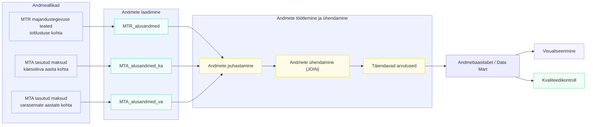

# MTR_toitlustus_aktiivsus_analyys

## Äriküsimus

Kui suur osa majandustegevuseteate esitanud toitlustusettevõtetest hakkab reaalselt majandustegevust näitama (käive ja töötajad) ning kui kiiresti see toimub?

### Mõõdikud:

1. Osakaal majandustegevusteate esitanud isikutest, kes deklareerivad töötajaid MTA andmetel (grupid: varasemalt töötajad, kuni 3 kuud, 4-6 kuud, 6-12 kuud, üle 12 kuu)
2. Osakaal majandustegevusteate esitanud isikutest, kes deklareerivad käivet MTA andmetel (grupid: varasemalt töötajad, kuni 3 kuud, 4-6 kuud, 6-12 kuud, üle 12 kuu)

## Andmeallikad

| Allikas                                                                                       | tüüp      | Uuenemise aeg    | Roll          |
| :-------------------------------------------------------------------------------------------- | :-------- | :--------------- | :------------ |
| Majandustegevuse register                                                                     | andmebaas | reaalajas uuenev | põhiandmevoog |
| Maksu- ja Tolliameti avaandmed tasutud maksude, käibe ja töötajate kohta käesoleval aastal    | fail      | korra kvartalis  | põhiandmevoog |
| Maksu- ja Tolliameti avaandmed tasutud maksude, käibe ja töötajate kohta varasematel aastatel | fail      | ei uuene         | lisaandmevoog |

## Andmevoog

## Andmebaasi kihid

| Kiht | Roll |
| :--- | :--- |
|      |

...

## Tööjaotus

| Roll                       | Vastutus                                                  | Nimi         |
| :------------------------- | :-------------------------------------------------------- | :----------- |
| Andmeallika omanik         | Kirjutab sissevõtu loogika                                | Kaisa Eesmaa |
| Transformatsioonide omanik | Kirjutab andmete ühendamise ja mõõdikute arvutuse loogika |
| Kvaliteedi omanik          | Kirjutab testid ja vaatab läbi ebaõnnestunud testid       |
| Näidikulaua omanik         | Ehitab vaate                                              |

## Riskid

| Risk                                 | Mõju                                                       | Maandus                                                    |
| ------------------------------------ | ---------------------------------------------------------- | ---------------------------------------------------------- |
| Võrgupäring ei vasta                 | Andmeid ei saa värskendada                                 | Skript annab veateate, vajadusel käivitata uuesti.         |
| MTA uuendab andmeid korra kvartalis  | Värskete majandustegevusteadete kohta ei saa analüüsi teha | Leppida või leida teine infoalllikas                       |
| MTR muudab CSV faili andmestruktuuri | Andmeid ei saa värskendada                                 | Skript annab veateate, parandada skripti, käivitada uuesti |

## Privaatsus ja turve

Projekt kasutab ainult avalikke andmeid (MTR valik register ja MTA avaandmed). Isikuandmeid ei koguta. Andmebaasi kasutajanimi ja parool tulevad .env failist. .env faili ei tohi reposse lisada.
